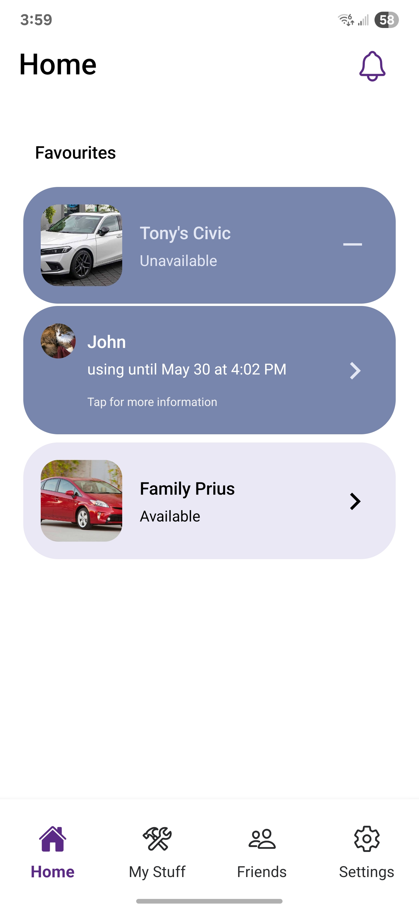
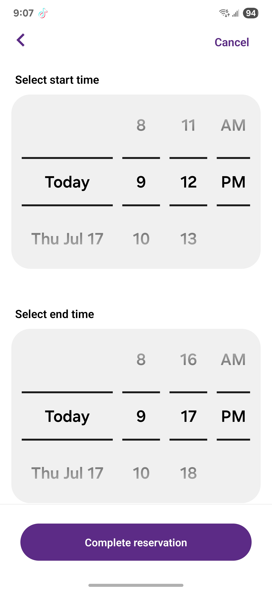
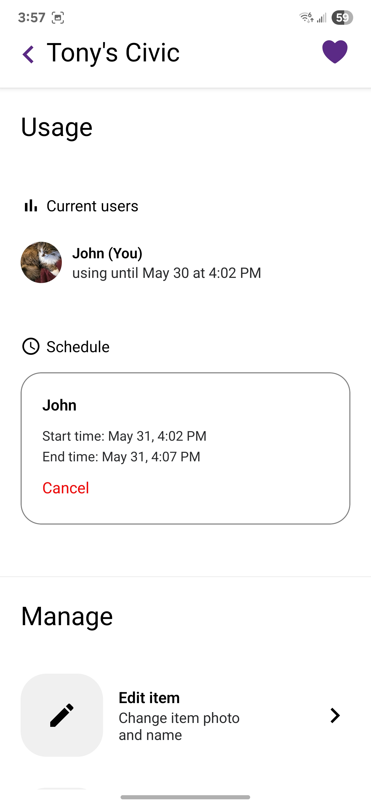

# Common Room (React Native + Expo)

An android scheduling app to help users manage communal sharing of anything they choose. Built with Expo and Firebase.

## 🚀 Features
- Simple account creation with Google sign-in.
- Create trackers with a name and photo to share with whomever you choose.
- Make reservations on trackers to start and stop at any time.
- Get notified of reservations via push notifications.
- Firebase Firestore + Storage for data sync
- Firebase Auth + Functions for cloud-based processes
- Light & dark theme toggle

## 🛠 Tech Stack
- React Native (Expo)
- Firebase (Auth + Firestore + Storage + Functions)
- Expo Navigation
- TypeScript

## 📱 Screenshots
<p float="left">
  
  
  
  
</p>

## 🔗 Live Demo
[Goole Play Store](https://play.google.com/apps/testing/com.louie1124.test3)

## 📂 Getting Started
 - Insert your google-services.json and GoogleService-Info.plist into root directory
 - Configure your firebase in configs/firebaseConfig.tsx

```bash
git clone https://github.com/Louie112/Common-Room-Mobile
cd Common-Room-Mobile
npm install
npx expo run:android
